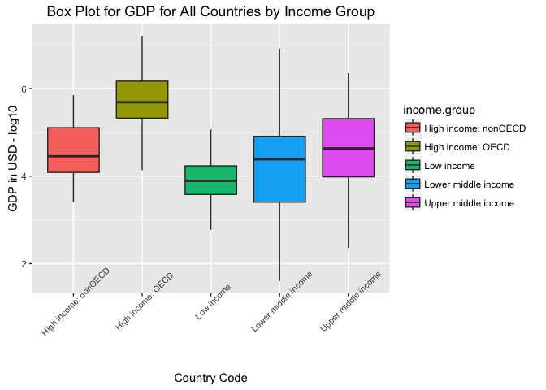

# World Country GDP and Income Groups Evaluation
Ramesh Simhambhatla  
October 29, 2016  
# Index: 
* Part1: Introduction with purpose of the document.
* Part2: Instructions to set the development environment to execute the R code.
* Part3: Downloading GDP and Federal Statstical data, cleaning, merging and creating tidy data.
* Part4: Evaluate answers for the case study questions
* Part5: Conclusion
* Part6: References

## Part 1: Introduction
The following case study is to evaluate the GDP and Income data categories provided by Federal Statistics for Educational purposes. The intent is to study various data points available for all the countries in two separate files, clean and merge them to perform some specific analysis as required.

## Part 2: Set the environment ready to execute the coding steps


```r
library(knitr)
opts_knit$set(root_dir = "/Users/rsimham/Documents/Ramesh/SMU/GitRepos/Case Studies/MSDS-CaseStudy1")
```
Download and install the libraries, if not already available in the session
(commented the following statements since the packages are already installed in my session)

```r
# install.packages("repmis")    # Misc tools for Reproduciable Research
# install.packages("plyr")      # Tools for Splitting, Applying and Combining Data
# install.packages("ggplot2")   # Used for Advanced Graphics
```

Load the packages to ensure that packages/functions are available when referenced

```r
library(repmis)
library(plyr)
library(ggplot2)
```

## Part 3: Download the source data, clean, merge and create tidy data for analysis


```r
# download the files and read into tables 
source("./Analysis/data/countryGDPrawdata.R", echo=TRUE, keep.source = TRUE)
```

```
## 
## > ########################################################################################
## > # Purpose: Read the GDP raw data for all countries file
## > .... [TRUNCATED] 
## 
## > # download the file from the URL set 
## > download.file(countryGDPUrl, destfile = "./countryGDPdata.csv")
## 
## > # read csv into a data frame
## > # preserve character data type where approrpiate - use stringsAsFactors
## > # current headers not appropriate, make it  .... [TRUNCATED] 
## 
## > # get dimension, variable names, and structure of the data
## > # dimension of the dataframe shows observations and variables
## > dim(countryGDPraw)
## [1] 331  10
## 
## > # examine general schema/structure of the table to determine useful variables and observations 
## > # for merge and analysis
## > str(countryGDPraw)
## 'data.frame':	331 obs. of  10 variables:
##  $ V1 : chr  "" "" "" "" ...
##  $ V2 : chr  "Gross domestic product 2012" "" "" "Ranking" ...
##  $ V3 : logi  NA NA NA NA NA NA ...
##  $ V4 : chr  "" "" "" "Economy" ...
##  $ V5 : chr  "" "" "(millions of" "US dollars)" ...
##  $ V6 : chr  "" "" "" "" ...
##  $ V7 : logi  NA NA NA NA NA NA ...
##  $ V8 : logi  NA NA NA NA NA NA ...
##  $ V9 : logi  NA NA NA NA NA NA ...
##  $ V10: logi  NA NA NA NA NA NA ...
## 
## > message("Observations while reading the GDP raw data file: 
## + a. GDP data file contains GDP data for 190 countries with ranking. 
## + b. The file do n ..." ... [TRUNCATED]
```

```
## Observations while reading the GDP raw data file: 
## a. GDP data file contains GDP data for 190 countries with ranking. 
## b. The file do not have appropriate headers, so removed while reading into the data frame
## c. String data read as factors, so prevented while reading the file
## d. The file contains various other data, which may not be required for final analysis
```

```r
source("./Analysis/data/countryFedStatsrawdata.R", echo=TRUE, keep.source = TRUE)
```

```
## 
## > ########################################################################################
## > # Purpose: Load the Federal Educational Statistical data  .... [TRUNCATED] 
## 
## > # download the file from the URL set 
## > download.file(countryFedStatsUrl, destfile = "./countryFedStats.csv")
## 
## > # read csv into a data frame
## > # preserve character data type where approrpiate - use stringsAsFactors
## > # current headers looks ok, keep them for n .... [TRUNCATED] 
## 
## > ## get dimension, variable names, and structure of the data
## > ## dimension of the dataframe shows observations and variables
## > dim(countryFedStatsra .... [TRUNCATED] 
## [1] 234  31
## 
## > ## examine general schema/structure of the table to determine useful variables and observations 
## > ## for merge and analysis
## > str(countryFedStatsra .... [TRUNCATED] 
## 'data.frame':	234 obs. of  31 variables:
##  $ CountryCode                                      : chr  "ABW" "ADO" "AFG" "AGO" ...
##  $ Long.Name                                        : chr  "Aruba" "Principality of Andorra" "Islamic State of Afghanistan" "People's Republic of Angola" ...
##  $ Income.Group                                     : chr  "High income: nonOECD" "High income: nonOECD" "Low income" "Lower middle income" ...
##  $ Region                                           : chr  "Latin America & Caribbean" "Europe & Central Asia" "South Asia" "Sub-Saharan Africa" ...
##  $ Lending.category                                 : chr  "" "" "IDA" "IDA" ...
##  $ Other.groups                                     : chr  "" "" "HIPC" "" ...
##  $ Currency.Unit                                    : chr  "Aruban florin" "Euro" "Afghan afghani" "Angolan kwanza" ...
##  $ Latest.population.census                         : chr  "2000" "Register based" "1979" "1970" ...
##  $ Latest.household.survey                          : chr  "" "" "MICS, 2003" "MICS, 2001, MIS, 2006/07" ...
##  $ Special.Notes                                    : chr  "" "" "Fiscal year end: March 20; reporting period for national accounts data: FY." "" ...
##  $ National.accounts.base.year                      : chr  "1995" "" "2002/2003" "1997" ...
##  $ National.accounts.reference.year                 : int  NA NA NA NA 1996 NA NA 1996 NA NA ...
##  $ System.of.National.Accounts                      : int  NA NA NA NA 1993 NA 1993 1993 NA NA ...
##  $ SNA.price.valuation                              : chr  "" "" "VAB" "VAP" ...
##  $ Alternative.conversion.factor                    : chr  "" "" "" "1991-96" ...
##  $ PPP.survey.year                                  : int  NA NA NA 2005 2005 NA 2005 2005 NA NA ...
##  $ Balance.of.Payments.Manual.in.use                : chr  "" "" "" "BPM5" ...
##  $ External.debt.Reporting.status                   : chr  "" "" "Actual" "Actual" ...
##  $ System.of.trade                                  : chr  "Special" "General" "General" "Special" ...
##  $ Government.Accounting.concept                    : chr  "" "" "Consolidated" "" ...
##  $ IMF.data.dissemination.standard                  : chr  "" "" "GDDS" "GDDS" ...
##  $ Source.of.most.recent.Income.and.expenditure.data: chr  "" "" "" "IHS, 2000" ...
##  $ Vital.registration.complete                      : chr  "" "Yes" "" "" ...
##  $ Latest.agricultural.census                       : chr  "" "" "" "1964-65" ...
##  $ Latest.industrial.data                           : int  NA NA NA NA 2005 NA 2001 NA NA NA ...
##  $ Latest.trade.data                                : int  2008 2006 2008 1991 2008 2008 2008 2008 NA 2007 ...
##  $ Latest.water.withdrawal.data                     : int  NA NA 2000 2000 2000 2005 2000 2000 NA 1990 ...
##  $ X2.alpha.code                                    : chr  "AW" "AD" "AF" "AO" ...
##  $ WB.2.code                                        : chr  "AW" "AD" "AF" "AO" ...
##  $ Table.Name                                       : chr  "Aruba" "Andorra" "Afghanistan" "Angola" ...
##  $ Short.Name                                       : chr  "Aruba" "Andorra" "Afghanistan" "Angola" ...
## 
## > message("Observations while reading the Federal Stats raw data file: 
## + a. GDP data file contains Federal Stats on Income and some census survey dat ..." ... [TRUNCATED]
```

```
## Observations while reading the Federal Stats raw data file: 
## a. GDP data file contains Federal Stats on Income and some census survey data with 234 observations.
## b. The file has appropriate headers and kept it while reading
## c. Only Contry Code and Income Group has relavent and useful data for analysis
## d. The file contains various other data, incomplete, which is not be required for final analysis
```

```r
#### clean the source files, and create tidy data
source("./Analysis/data/countryGDPcleandata.R", echo=TRUE, keep.source = TRUE)
```

```
## 
## > ########################################################################################
## > # Purpose: create a clean/tidy GDP table for later analys .... [TRUNCATED] 
## 
## > head(countryGDPfinal)
##     V1 V2 V3             V4           V5 V6 V7 V8 V9 V10
## 6  USA  1 NA  United States  16,244,600     NA NA NA  NA
## 7  CHN  2 NA          China   8,227,103     NA NA NA  NA
## 8  JPN  3 NA          Japan   5,959,718     NA NA NA  NA
## 9  DEU  4 NA        Germany   3,428,131     NA NA NA  NA
## 10 FRA  5 NA         France   2,612,878     NA NA NA  NA
## 11 GBR  6 NA United Kingdom   2,471,784     NA NA NA  NA
## 
## > # now remove columns/variables 3 and 6 to 10 - they are not required to consturct the GDP table
## > countryGDPfinal <- countryGDPfinal[,-c(3, 6:10)]
## 
## > # let's rename the column or variable names to match relavent data
## > names(countryGDPfinal) # current variable names
## [1] "V1" "V2" "V4" "V5"
## 
## > names(countryGDPfinal) <- c("countrycode", "rank", "countryname", "gdpinusd") #set new names
## 
## > names(countryGDPfinal) # verify new names are set correctly
## [1] "countrycode" "rank"        "countryname" "gdpinusd"   
## 
## > # let's verify the data types of the final variables
## > str(countryGDPfinal)
## 'data.frame':	190 obs. of  4 variables:
##  $ countrycode: chr  "USA" "CHN" "JPN" "DEU" ...
##  $ rank       : chr  "1" "2" "3" "4" ...
##  $ countryname: chr  "United States" "China" "Japan" "Germany" ...
##  $ gdpinusd   : chr  " 16,244,600 " " 8,227,103 " " 5,959,718 " " 3,428,131 " ...
## 
## > # convert "rank" to integer, and "gdpinusd" to numeric
## > countryGDPfinal$rank <- as.integer(countryGDPfinal$rank)
## 
## > countryGDPfinal$gdpinusd <- as.numeric(gsub("[^[:digit:]]","",countryGDPfinal$gdpinusd))
## 
## > # let's verify the data types of the final variables
## > str(countryGDPfinal)
## 'data.frame':	190 obs. of  4 variables:
##  $ countrycode: chr  "USA" "CHN" "JPN" "DEU" ...
##  $ rank       : int  1 2 3 4 5 6 7 8 9 10 ...
##  $ countryname: chr  "United States" "China" "Japan" "Germany" ...
##  $ gdpinusd   : num  16244600 8227103 5959718 3428131 2612878 ...
## 
## > # now countryCode and CountryName are chars; rank is integer and GDPinUSD is numeric.
## > dim(countryGDPfinal) # will show the table 190 countries wit .... [TRUNCATED] 
## [1] 190   4
## 
## > # save the table to external csv file for reference
## > write.csv(countryGDPfinal, file="countryGDPfinal.csv")
## 
## > message("Clean up performed on GDP raw data file: 
## + a. Removed observations <5 and >195 as they doesn't belong or don't have GDP data.
## + b. Removed ..." ... [TRUNCATED]
```

```
## Clean up performed on GDP raw data file: 
## a. Removed observations <5 and >195 as they doesn't belong or don't have GDP data.
## b. Removed variables 3 and 6 through 10 as they do not contain relavent useful GDP data.
## c. Added new variobles names (or column headers) to map the observations appropriately.
## d. Converted rank and GDP data to integer and numeric respectively
## e. Total 190 observations are included in the final output
```

```r
source("./Analysis/data/countryFedStatscleandata.R", echo=TRUE, keep.source = TRUE)
```

```
## 
## > ###########################
## > # Purpose: create a tidy federal stats table for merge with GDP data & later analysis
## > # Author: Ramesh Simhambhatla
##  .... [TRUNCATED] 
## 
## > #first convert all names to lowercase for easier reference and consistency
## > names(countryFedStats) <- tolower(names(countryFedStats)) 
## 
## > # determine unique type of Income Groups
## > unique(countryFedStats$income.group) 
## [1] "High income: nonOECD" "Low income"           "Lower middle income" 
## [4] "Upper middle income"  "High income: OECD"    ""                    
## 
## > # will ouput FALSE for blanks, and TRUE non valid
## > count(countryFedStats$income.group != "") 
##       x freq
## 1 FALSE   24
## 2  TRUE  210
## 
## > # identify observation numbers (row number) for degrouping
## > noIncomeGroup <- which(countryFedStats$income.group == "")
## 
## > noIncomeGroup # view the rows for exclusion
##  [1]  55  56  57  58  61  85  88 113 119 120 121 124 125 136 139 144 153
## [18] 160 164 182 193 194 218 228
## 
## > # exclude those with income.group blank (not countries)
## > countryFedStats <- countryFedStats[(-1*noIncomeGroup),]
## 
## > # view first two variables to confirm they are not countries
## > # str(countryFedStats)[,1:2]
## > 
## > # since the case study is focussed on GDP and Incom .... [TRUNCATED] 
## 
## > str(countryFedStatsFinal)
## 'data.frame':	210 obs. of  2 variables:
##  $ countrycode : chr  "ABW" "ADO" "AFG" "AGO" ...
##  $ income.group: chr  "High income: nonOECD" "High income: nonOECD" "Low income" "Lower middle income" ...
## 
## > write.csv(countryFedStatsFinal, "countryFedStatsFinal.csv")
## 
## > message("Clean up performed on Federal Stats raw data file: 
## + a. Converted all names to lowercase for easier reference and consistency.
## + b. Countr ..." ... [TRUNCATED]
```

```
## Clean up performed on Federal Stats raw data file: 
## a. Converted all names to lowercase for easier reference and consistency.
## b. Country and non-counry data was mixed; Removed observations which do not have Income Group
## c. Final clean up data contains 210 observations with country code & income.group; rest of the variables discarded
```

```r
#### merge the dataset, remove unmatched records, and create final tidy data for analysis
source("./Analysis/data/countryGDPIncometidydata.R", echo=TRUE, keep.source = TRUE)
```

```
## 
## > ########################################################################################
## > # Purpose: merge cleaned GDP and Income Group data by cou .... [TRUNCATED] 
## 
## > # view top 6 observations to get an idea on ther merge
## > head(mergeGDPIncomeGroup)
##   countrycode rank          countryname gdpinusd         income.group
## 1         ABW  161                Aruba     2584 High income: nonOECD
## 2         AFG  105          Afghanistan    20497           Low income
## 3         AGO   60               Angola   114147  Lower middle income
## 4         ALB  125              Albania    12648  Upper middle income
## 5         ARE   32 United Arab Emirates   348595 High income: nonOECD
## 6         ARG   26            Argentina   475502  Upper middle income
## 
## > # view the structure of the merged data
## > str(mergeGDPIncomeGroup)
## 'data.frame':	189 obs. of  5 variables:
##  $ countrycode : chr  "ABW" "AFG" "AGO" "ALB" ...
##  $ rank        : int  161 105 60 125 32 26 133 172 12 27 ...
##  $ countryname : chr  "Aruba" "Afghanistan" "Angola" "Albania" ...
##  $ gdpinusd    : num  2584 20497 114147 12648 348595 ...
##  $ income.group: chr  "High income: nonOECD" "Low income" "Lower middle income" "Upper middle income" ...
## 
## > # No further clean up required, mark it as clean and tidy
## > cleanGDPIncomeGroup <- mergeGDPIncomeGroup
## 
## > # save the table to external csv file for reference
## > write.csv(cleanGDPIncomeGroup, file="cleanGDPIncomeGroup.csv")
## 
## > message("Following actions performed to create tidy data: 
## + a. merged the cleaned GDP and Federal Stats data by countrycode
## + b. 189 observations h ..." ... [TRUNCATED]
```

```
## Following actions performed to create tidy data: 
## a. merged the cleaned GDP and Federal Stats data by countrycode
## b. 189 observations have matches; remove unmatched observations
```

##  Part 4: Peform Analysis per the cleaned and tidy data


```r
# Analyse the tidy data to provide answers to Case Study questions.
source("./Analysis/caseStudyAnalysis.R", echo=TRUE, keep.source = TRUE)
```

```
## 
## > ############
## > # QUESTION 1: Merge the data based on the country shortcode. How many of the IDs match? 
## > # ANSWER: 189 matches per the str function .... [TRUNCATED] 
## [1] 189
## 
## > message("Number of matches after merging with country shortcode: ", nrow(cleanGDPIncomeGroup))
```

```
## Number of matches after merging with country shortcode: 189
```

```
## 
## > ############
## > # QUESTION 2: Sort the data frame in ascending order by GDP (so United States is last). 
## > # What is the 13th country in the resultin .... [TRUNCATED] 
## 
## > str(cleanGDPIncomeGroup)
## 'data.frame':	189 obs. of  5 variables:
##  $ countrycode : chr  "TUV" "KIR" "MHL" "PLW" ...
##  $ rank        : int  190 189 188 187 186 185 184 183 182 181 ...
##  $ countryname : chr  "Tuvalu" "Kiribati" "Marshall Islands" "Palau" ...
##  $ gdpinusd    : num  40 175 182 228 263 326 472 480 596 684 ...
##  $ income.group: chr  "Lower middle income" "Lower middle income" "Lower middle income" "Upper middle income" ...
## 
## > # find the countryname for the 13th country in the data frame - KNA - St. Kitts and Nevis
## > message("The 13th country in the resulting data frame: " .... [TRUNCATED]
```

```
## The 13th country in the resulting data frame: St. Kitts and Nevis
```

```
## 
## > ############
## > # QUESTOIN 3: What are the average GDP rankings for the "High income: OECD" and 
## > # "High income: nonOECD" groups? 
## > OECDdata <- cl .... [TRUNCATED] 
## 
## > message("The average GDP rankings for the (High income: OECD): ", mean(OECDdata$rank))
```

```
## The average GDP rankings for the (High income: OECD): 32.9666666666667
```

```
## 
## > nonOECDdata <- cleanGDPIncomeGroup[which(cleanGDPIncomeGroup$income.group == "High income: nonOECD"),]
## 
## > message("The average GDP rankings for the (High income: nonOECD): ", mean(nonOECDdata$rank))
```

```
## The average GDP rankings for the (High income: nonOECD): 91.9130434782609
```

```
## 
## > ###########
## > #QUESTION 4:Plot the GDP for all of the countries. Use ggplot2 to color your plot by 
## > # Income Group.
## > 
## > ggplot(cleanGDPIncomeGrou .... [TRUNCATED]
```

```
## 
## > message("Observations from the boxplot of GDP data by income.group:
## + a. All countries in the High income: OECD group countries have higher than all ..." ... [TRUNCATED]
```

```
## Observations from the boxplot of GDP data by income.group:
## a. All countries in the High income: OECD group countries have higher than all other groups. 
##    These are generally regarded as developed countries.
## b. Median GDP of the High Income: nonOECD, Lower Middle Income and Uppler Middle income groups are
##    very close, shows possible wide income gap in this group.
## c. Number of countries in the Lower middle income group are high, could be related to 
##    high population, small or poor countries
```

```
## 
## > ###########
## > # QUESTION 5 (a):
## > #Cut the GDP ranking into 5 separate quantile groups. Make a table versus Income.Group. 
## > 
## > # Find quantiles and .... [TRUNCATED] 
## 
## > quantileGDP
##       0%      25%      50%      75%     100% 
##       40     6972    28242   205789 16244600 
## 
## > message("With GDP quantiles, it's very interesting to find the diveregence GDP differences between the countries
## + top 25% percentile of the countri ..." ... [TRUNCATED]
```

```
## With GDP quantiles, it's very interesting to find the diveregence GDP differences between the countries
## top 25% percentile of the countries account for >98.5% of world GDP; bottom 25% account for < 0.05% of GDP
```

```
## 
## > #QUESTION 5 (b):
## > # How many countries are Lower middle income but among the 38 nations with highest GDP?
## > countrylmiLT39 <- cleanGDPIncomeGroup[w .... [TRUNCATED] 
## 
## > # Number of observations in the criteria: 5
## > message("Number of obversations with Lower middle income in top 38 GDP countries: ", nrow(countrylmiLT .... [TRUNCATED]
```

```
## Number of obversations with Lower middle income in top 38 GDP countries: 5
```

<!-- -->

```
## 
## > #############
```

## Part 5: Conclusion
* GDP data of world countries shows large economic gap between developed (High income: OECD) and other countries.
* Top 25% countries account for 98.5% of world GDP, while bottom 25% < 0.005 - shows economic disparity
* Observing "Lower middle income" countries, it's apparent that countries with highest population (such as China, India, Indonasia) has generated considerable GDP to be in top 20 of the list, but categorized as income group show the lower per capita for the population.
* The data is very limited to country GDP data. A more meaningul analysis could be done if country population, size, poverty and any other relavant data made available.

## Part 6: References
[SMU MSDS Case Study 1 instructions]( https://s3-us-west-2.amazonaws.com/smu-mds/prod/MSDS+6306+Doing+Data+Science/2016+Updates/Case-Study+1.pdf)
[Rmarkdown Cheatsheet](http://www.rstudio.com/wp-content/uploads/2016/03/rmarkdown-cheatsheet-2.0.pdf)
